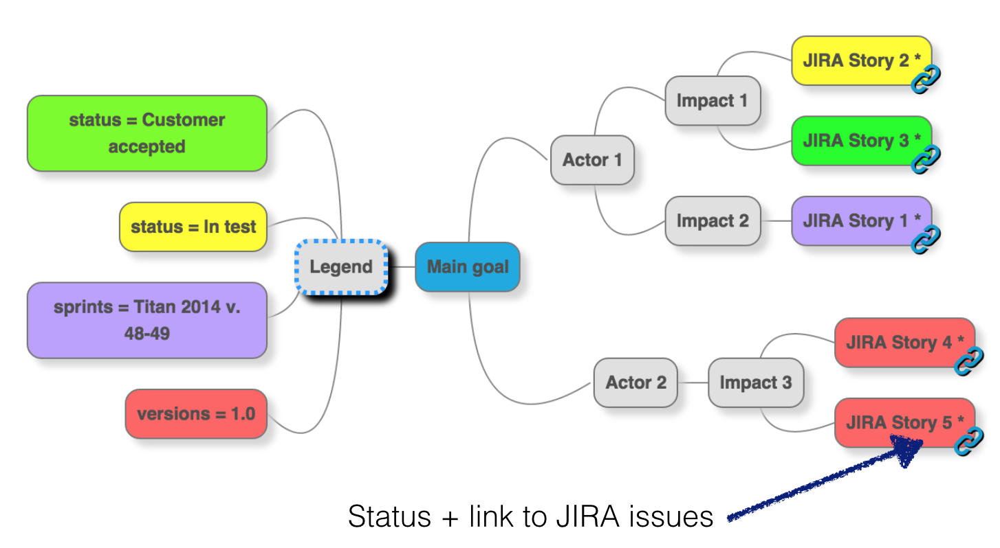
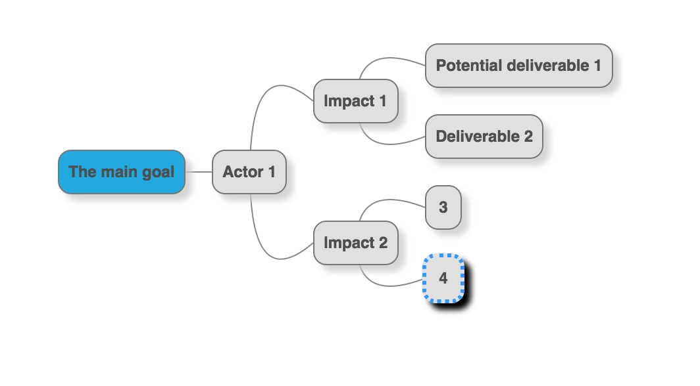
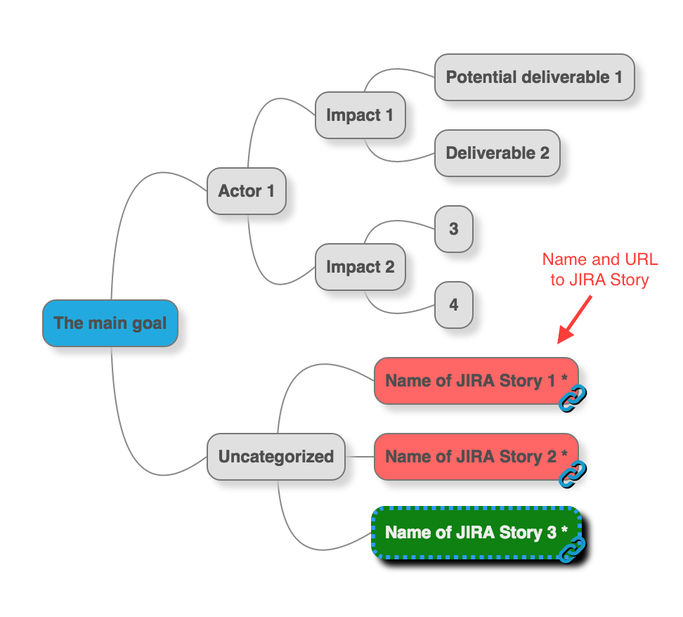
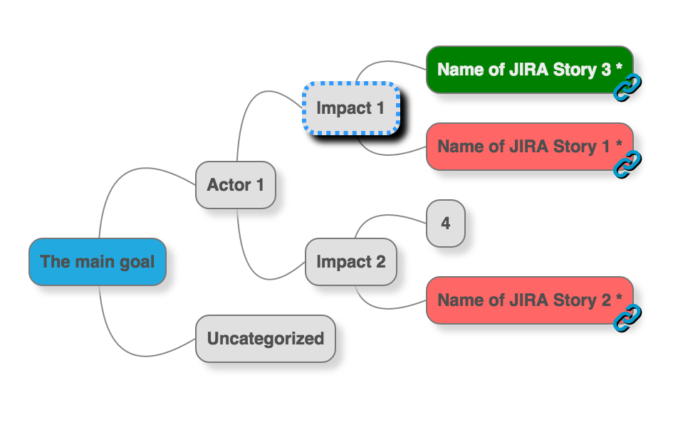
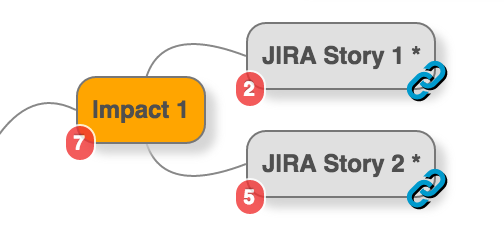

Backlog Visualizer
==================

What?
-----

A small hack to improve upon an impact map by adding status from a backlog tool (JIRA).

Basic idea
----------

1. [Mindmup](https://www.mindmup.com) is a great tool to create and share impact maps
2. My company uses JIRA as an agile management tool
3. In my opinion; JIRA does not provide a clear overview where I can show a customer where we are going and what goals we are working on right now
4. __It would be great to start with a mindmup and automatically add information from JIRA__
5.  __It would be great to be able to sync mindmap with JIRA at any time (without touching nodes that are not connected to a JIRA Story)__ 

Mindmup does not provide an API to change a mindmap. But my 'heureka'-moment was when I realized that [a Mindmup "*.mup"-file is just a json-file](https://github.com/mindmup/mapjs/wiki/Data-Format). 
So the basic idea of this tool is to take an existing "*.mup"-file and add status information and links to JIRA in that map, with a single shell-command.

## Requirements
* Ruby must be installed (Tested with Ruby 2.1)
* Bundler must be installed (gem install bundler)

## Install & use
1. Clone this repo and run:

		bundle install

3. Create a mindmap on mindmup.com (or use Mindmup Chrome Desktop app), store the map in same folder as cloned repo

_Example map_

## Now you are ready for first sync

1. Create a settings.yml file (copy [settings_example.yml](settings_example.yml), [settings_jira_credentials_example.yml](settings_jira_credentials_example.yml) and adapt to your needs, i.e. configure JIRA-search url, credentials, choose colors for JIRA-statuses etc.)
2. Run command:

		./lib/jiramap.sh

	or

		./lib/jiramap.rb --help  # To get available arguments

		Usage: jiramap.rb [options]
    	-s, --settings filename          Settings file name (if omitted 'settings.yml' is used)
    	-l, --legend                     Create a legend node that describes colors used in map
    	-o, --out filename               Output filename (if ommitted 'temp.mup' will be used)
    	-m, --add-measurement            Add measurement 'storypoints' to JIRA-nodes
 
The script creates a node "Uncategorized" and place all Stories from JIRA there.

Now use Mindmup to (manually) arrange synced stories as needed, and store the new map as "original file" for next sync.

_Example where initial ideas has been replaced with corresponding ideas in JIRA_

Whenever you want to resync the map with current JIRA status, just run the command again (with the last output file as "original file" in settings.yml). 
If the script finds existing JIRA-url:s in map, it will update those nodes instead of creting new nodes in "Uncategorized".

If command line option -m is used you can get estimates (storypoints) from JIRA too, agregated on each level in map.

_Example with storypoints_

### Tests

Tests are run with

		rspec 

### TODOs (maybe...)
* Make it possible to filter out all nodes that are "DONE" according to JIRA
* Visualize in a "mindmup-like" read-only-view

Do you like the idea? Please comment, make Pull requests or fork the project at your will!
